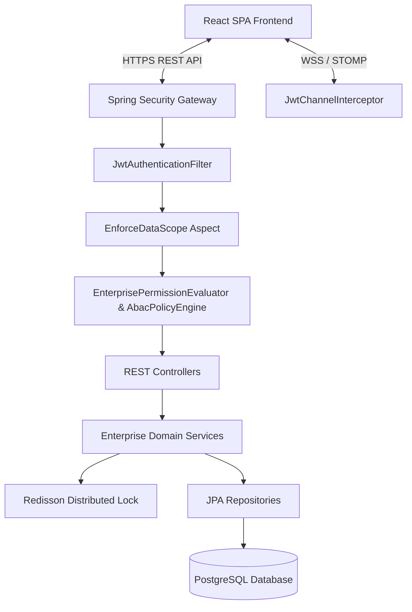

# System Architecture Document

## 1. Executive Summary
Eagle Auctioner is an enterprise B2B auction platform built with Spring Boot 3 (Java 21) on the backend and React (TypeScript + Vite) on the frontend. The platform provides live dynamic bidding, proxy bidding, sealed-bid auctions, real-time WebSocket price broadcasts, wallet/settlement financial management, and multi-channel notifications under a unified Enterprise Authorization Framework.

## 2. High-Level System Architecture

## 3. Technology Stack

* **Backend Framework**: Spring Boot 3.2.5 (Java 21)
* **Frontend Framework**: React 18, TypeScript, Vite, TailwindCSS
* **Security & Auth**: Spring Security 6, JWT, Enterprise ABAC Policy Engine, Custom Permission Evaluator
* **Database & Migration**: PostgreSQL 15, Flyway (V1 through V8 migrations)
* **Concurrency & Locking**: Redisson 3.27.2 (Distributed Locks for Auctions & Bids)
* **Real-time Messaging**: Spring WebSocket with STOMP & SockJS (`/ws-auction`)
* **Logging & Monitoring**: Logback, SLF4J, Spring Boot Actuator

## 4. Key Architectural Patterns

1. **Enterprise Authorization Framework**: Every REST endpoint is guarded by Action Permissions (`hasAuthority('action.key')`) and Data Scope annotations (`@EnforceDataScope(DataScopeType)`).
2. **Maker-Checker Segregation of Duties**: Financial operations such as refunds and winner overrides enforce hard security boundaries preventing self-approval.
3. **Outbox Event Pattern**: Events are persisted to `outbox_events` within database transactions and processed asynchronously.
4. **Distributed Mutual Exclusion**: Auction extensions and bid submissions acquire Redisson locks (`auction:{auctionId}`) to avoid race conditions under load.
